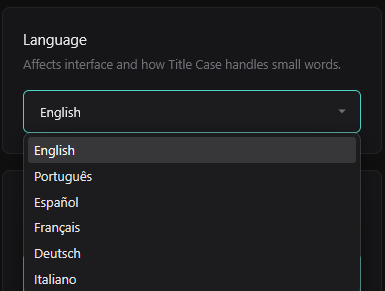
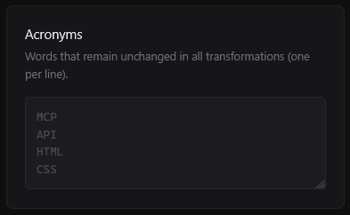

# Case Switcher

**Transform text case with professional intelligence.**

Case Switcher is a high-performance Firefox extension designed for developers, writers, and content creators who demand precision in text formatting. Built on the robust Manifest V3 architecture, it offers secure, local-only processing with advanced linguistic rules.

## Core Philosophy

Designed by **Mycellium Tech** using **Advanced Agentic Coding (Vibe Coding)** methodologies, this project exemplifies the intersection of rapid AI-assisted development and rigorous software engineering standards.

- **Privacy First:** 100% offline processing. No data ever leaves your device.
- **Efficiency:** Optimized for sub-millisecond transformations.
- **Standardization:** Adheres to strict typographic and industry standards.

## Key Features

### Intelligent Transformation Modes
Transform text instantly using 10 specialized modes suited for coding, writing, and url formatting.

- **Title Case:** Context-aware capitalization that respects small words (articles, prepositions) based on the selected language.
- **URL Slug:** Converts text to clean, SEO-friendly interaction slugs (e.g., `Case Switcher` -> `case-switcher`).
- **Sentence Case:** Smartly capitalizes the first letter of sentences while preserving proper nouns where possible.
- **Developer Modes:** `camelCase`, `kebab-case`, `snake_case` for rapid variable formatting.

### Context Menu Integration
Seamlessly integrated into your workflow. Just select text and right-click.

### Multi-Language Support
Advanced grammatical rules for exact Title Case handling in:
- 🇺🇸 English
- 🇧🇷 Portuguese
- 🇪🇸 Spanish
- 🇫🇷 French
- 🇩🇪 German
- 🇮🇹 Italian

### Acronym Immunity
Define a custom list of acronyms (e.g., `HTML`, `API`, `USA`) that remain strictly uppercase regardless of the selected transformation mode. This preservation ensures technical accuracy in your documentation and code.

### Global Shortcuts & Context Menu
Access transformations via a non-intrusive Context Menu or customizable global shortcuts (default `Alt+Shift+0-9`) designed to avoid conflicts with browser defaults.

## Installation

1. **Firefox Add-ons Store:** [Coming Soon]
2. **Manual Installation (Developer Mode):**
    - Clone this repository.
    - Go to `about:debugging#/runtime/this-firefox`.
    - Click "Load Temporary Add-on...".
    - Select the `manifest.json` file from the project root.

## Technical Architecture

This project is a showcase of **Vibe Coding**—a methodology emphasizing high-velocity, intent-centric development.

- **Stack:** Pure JavaScript (ES6+), CSS3 Variables, HTML5.
- **Architecture:** Manifest V3 (Service Worker based).
- **Communication:** Secure message passing between Context/Background/Option scopes.
- **Zero-Dependency:** No external libraries or frameworks to ensure maximum security and minimum footprint.

## License

Copyright © 2026 Mycellium Tech.
Released under the MIT License.
